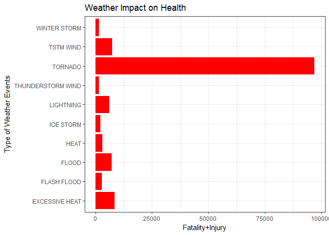
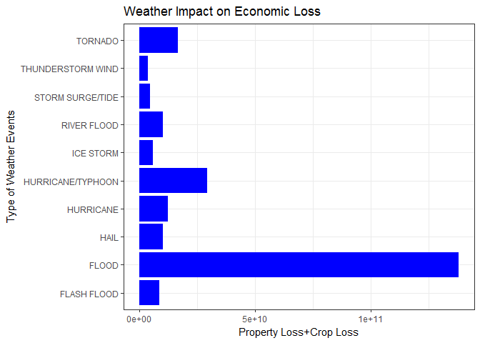
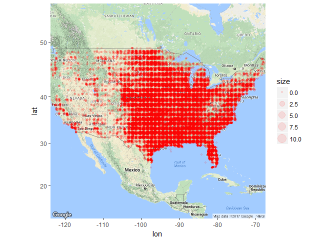

An Analysis of Impact from Severe Weather Events on Population Health and Economic Damange in U.S. from 1950 to Nov 2011
========================================================================================================================

Synopsis
--------

This project involves exploring the U.S. National Oceanic and
Atmospheric Administration's (NOAA) storm database, and an analysis is
subsequently done to study the impact from severe weather events in U.S.
from year 1950 and end in November 2011. The raw data are loaded and
processed in R. The total impact of population health and economic
damage are aggregated by each disaster type and plotted in barcharts. In
the result section, Tornado and Flood are found to be the most severe
weather events in impacting population health and economic damage
respectively. In the last section, the Tornado location is plotted on
top of map to identify the area that are prone to Tornado disaster.

Data Processing
---------------

### Loading and reading the data

    # Setup the WD, download the file
    setwd('C:/Users/skyqi/Desktop/Coursera_Reproducible Research_PA 2')
    if(!file.exists('data')) dir.create('data')
    fileUrl <- 'https://d396qusza40orc.cloudfront.net/repdata%2Fdata%2FStormData.csv.bz2'
    download.file(fileUrl,destfile='./data/repdata_data_StormData.csv.bz2')
    # Load readr package to use read_csv function and load the data
    library(readr)

    ## Warning: package 'readr' was built under R version 3.3.3

    StormData <- read_csv('./data/repdata_data_StormData.csv.bz2',col_types='dcccdcccdccccdcdccdddddddcdccccddddcd',progress=F)

### Setting up functions

1.  setup function to sort data decendingly

<!-- -->

    # function of sorting data decendingly
    sortDF <- function(df, by){
      df <- df[order(by, decreasing = T),]
      return (df)
    }

1.  Setup function to transform EXP to integers

<!-- -->

    # function of transforming EXP to integers
    transformEXP <- function(var){
      if (class(var)!= 'character') var= sapply(var, as.character)
      x=tolower(var)
      x[x=='b']<-9
      x[x=='h']<-2
      x[x=='k']<-3
      x[x=='m']<-6
      x[x %in% c("","-","?","+")]<-0
      x=as.integer(x)
      return (x)
    }

### Processing data

1.  Aggregate Fatality and Injury by Type

<!-- -->

    StormData$healthImpact<-StormData$FATALITIES+StormData$INJURIES
    healthImpactByType<-aggregate(healthImpact~EVTYPE,data=StormData,sum)
    healthImpactByType<-sortDF(healthImpactByType,healthImpactByType$healthImpact)

1.  Aggregate Economic Loss by Type

<!-- -->

    StormData$PROPDMGEXP<-transformEXP(StormData$PROPDMGEXP)
    StormData$CROPDMGEXP<-transformEXP(StormData$CROPDMGEXP)
    StormData$PropLoss<-with(StormData,(PROPDMG*(10**PROPDMGEXP)+CROPDMG*(10**CROPDMGEXP)))
    PropLossByType<-aggregate(PropLoss~EVTYPE,data=StormData,sum)
    PropLossByType<-sortDF(PropLossByType,PropLossByType$PropLoss)

Results
-------

### Plot the top 10 disaster types:

Tornado is found to be the most severe disaster in U.S. in terms of
population health.  
Flood is found to be the most severe disaster in U.S. in terms of
economic damage.

    library(ggplot2)

    ## Warning: package 'ggplot2' was built under R version 3.3.3

    ggplot(healthImpactByType[1:10,],aes(EVTYPE,healthImpact))+geom_bar(stat='identity',fill='red')+theme_bw()+coord_flip()+
      labs(title='Weather Impact on Health',x='Type of Weather Events',y='Fatality+Injury')

    ggplot(PropLossByType[1:10,],aes(EVTYPE,PropLoss))+geom_bar(stat='identity',fill='blue')+theme_bw()+coord_flip()+
      labs(title='Weather Impact on Economic Loss',x='Type of Weather Events',y='Property Loss+Crop Loss')

### Plot the location of the Tornado

    library(ggmap)

    ## Warning: package 'ggmap' was built under R version 3.3.3

    Tornado<-StormData[StormData$EVTYPE=='TORNADO',]
    Tornado$LONGITUDE<-(-Tornado$LONGITUDE/100)
    Tornado$LATITUDE<-Tornado$LATITUDE/100
    map<-get_map('United States',zoom=4)

    ## Map from URL : http://maps.googleapis.com/maps/api/staticmap?center=United+States&zoom=4&size=640x640&scale=2&maptype=terrain&language=en-EN&sensor=false

    ## Information from URL : http://maps.googleapis.com/maps/api/geocode/json?address=United%20States&sensor=false

    Tornado$size<-round(Tornado$healthImpact/max(Tornado$healthImpact) *10 ,2)
    ggmap(map)+geom_jitter(aes(LONGITUDE,LATITUDE,size=size),data=Tornado,alpha=0.1,colour='red')

    ## Warning: Removed 1081 rows containing missing values (geom_point).

The tornado is mostly happened in center and southeast coast of the
United States.
